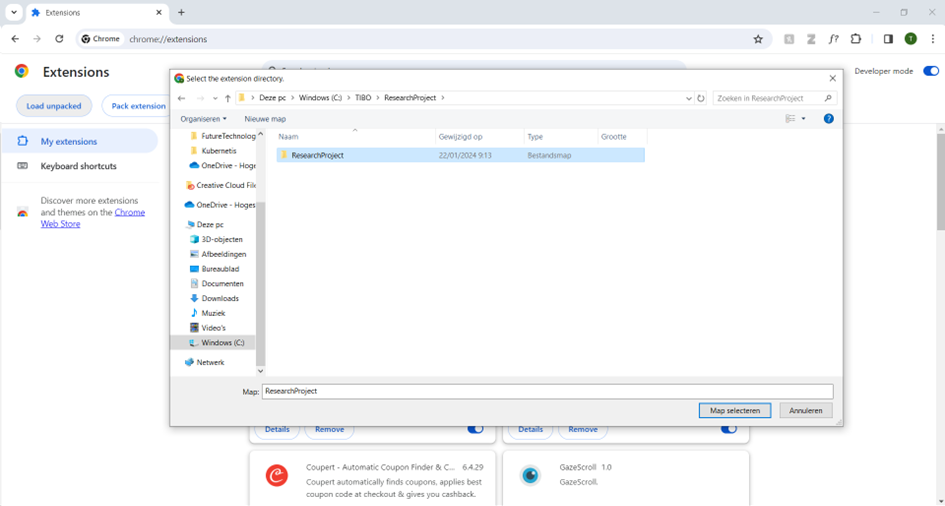

# ResearchProject

## Introduction

This project is conducted as part of the Research Project course at Howest-Kortrijk. The primary objective is to explore the potential applications of eye-tracking technology for website interaction.

To achieve this goal, a Chrome extension has been developed, enabling compatibility with any website. The GazeCloudAPI is employed to monitor the user's eye movements, while a MediaPipe face landmark model is utilized to detect blinking movements.

By combining these technologies, the project aims to enhance the user experience by introducing novel methods of interacting with websites through eye-tracking functionality.

## Installation
Download this repository and save it somewhere on your pc.

Go to “chrome://extensions/” in a chrome browser

Click in the “Load unpacked” button  
And open the just downloaded code map
 
 

## Usage
Open a Chrome browser and click on the extension button
Click on the desired extension

The extension opens and is ready to be used. 
You can also customize the scrolling speed and blink options

## Inspiration links
1) API for eye tracking:  
https://gazerecorder.com/

2) Article on how to use the API and why its better then WebGazer: 
https://medium.com/@williamwang15/integrating-gazecloudapi-a-high-accuracy-webcam-based-eye-tracking-solution-into-your-own-web-app-2d8513bb9865

3) Second article on why GazeCloudAPI is better then WebGazer: 
https://medium.com/@c.e.moll/a-short-eye-tracking-software-comparison-335721e4a95e

4) Video on the concept of using eye tracking to interact with a webshop: 
https://youtu.be/tvgJ9DsgVso

5) Eye blink detection: 
https://www.geeksforgeeks.org/eye-blink-detection-with-opencv-python-and-dlib/

6) Eye blink detection MediaPipe Face Landmark Detection Example on what it does: 
https://mediapipe-studio.webapps.google.com/studio/demo/face_landmarker

7) Eye blink detection MediaPipe Face Landmark Detection Code Example on how to use it: 
https://codepen.io/mediapipe-preview/pen/OJBVQJm